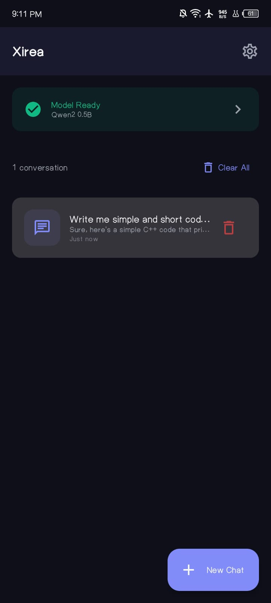
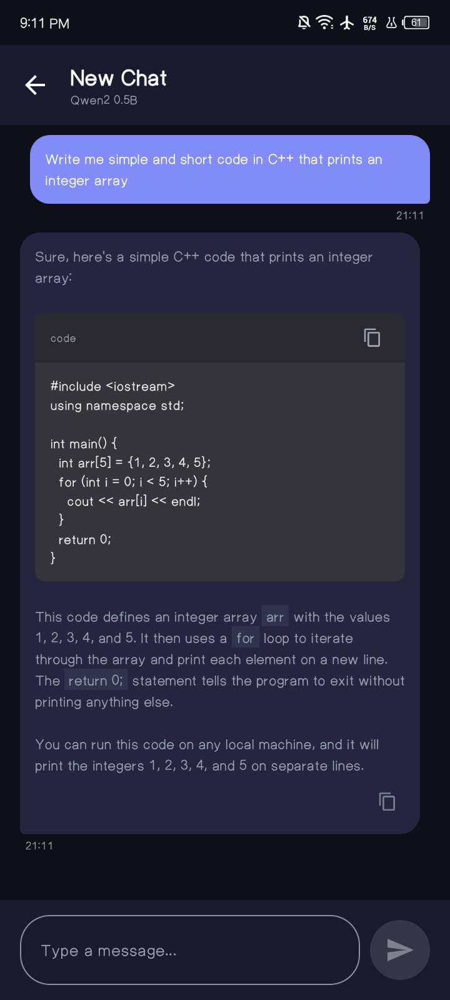
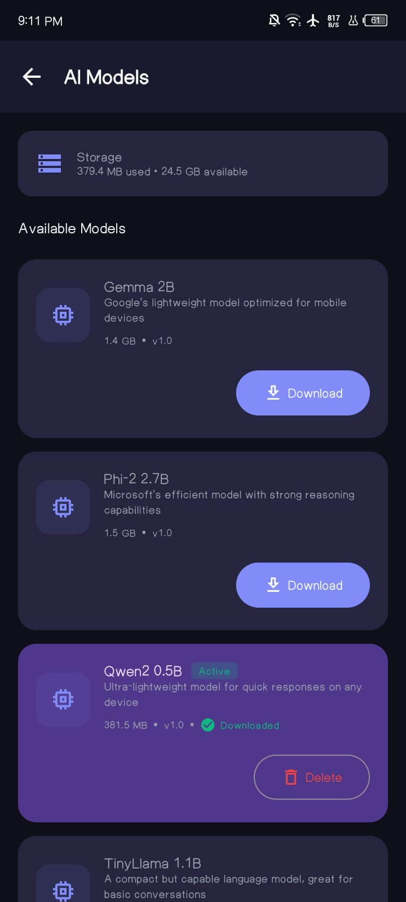
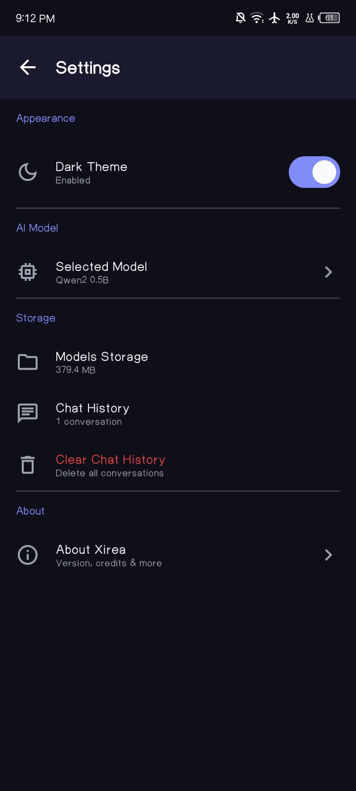

# Xirea

<p align="center">
  
</p>

<p align="center">
  <b>Offline AI Chat Assistant for Android</b>
</p>

<p align="center">
  <a href="#features">Features</a> •
  <a href="#screenshots">Screenshots</a> •
  <a href="#installation">Installation</a> •
  <a href="#building">Building</a> •
  <a href="#tech-stack">Tech Stack</a> •
  <a href="#license">License</a>
</p>

---

## Overview

**Xirea** is a fully offline AI chat assistant that runs lightweight language models directly on your Android device. No internet required, no API keys, no data leaving your phone — your conversations stay completely private.

Powered by [llama.cpp](https://github.com/ggerganov/llama.cpp) for efficient on-device inference with GGUF models.

---

## Features

- 🔒 **100% Offline** — All AI processing happens on-device
- 🚀 **Fast Inference** — Optimized for mobile with dynamic RAM scaling
- 💬 **Chat History** — Persistent local storage with Room database
- 📥 **Model Management** — Download, switch, and delete AI models
- 🌙 **Dark Mode** — Beautiful Material3 light and dark themes
- 📱 **Modern UI** — Built with Jetpack Compose
- 🔐 **Privacy First** — No data collection, no servers, no tracking

---

## Screenshots

| Home | Chat | Models | Settings |
|------|------|--------|----------|
|  |  |  |  |

---

## Installation

### Requirements

- Android 8.0+ (API 26)
- ARM64 device (arm64-v8a)
- At least 4GB RAM recommended
- Storage space for AI models (500MB - 4GB per model)

### Download

Download the latest APK from the [Releases](https://github.com/Danyalkhattak/xirea/releases) page.

---

## Building

### Prerequisites

- Android Studio Hedgehog or newer
- Android NDK 29.0.14206865
- CMake 3.22.1
- JDK 17

### Steps

1. **Clone the repository**
   ```bash
   git clone https://github.com/Danyalkhattak/xirea.git
   cd xirea
   ```

2. **Open in Android Studio**
   - Open the project folder in Android Studio
   - Wait for Gradle sync to complete

3. **Build Debug APK**
   ```bash
   ./gradlew assembleDebug
   ```

4. **Build Release APK** (requires signing keystore)
   ```bash
   ./gradlew assembleRelease
   ```

The APK will be generated at `app/build/outputs/apk/`

---

## Tech Stack

| Component | Technology |
|-----------|------------|
| **Language** | Kotlin |
| **UI Framework** | Jetpack Compose |
| **AI Engine** | llama.cpp (C++) |
| **Database** | Room |
| **Architecture** | MVVM |
| **Async** | Kotlin Coroutines + Flow |
| **DI** | Manual (lightweight) |
| **Theme** | Material3 |

---

## Supported Models

Xirea works with GGUF format models. Recommended models for mobile:

| Model | Size | RAM Required |
|-------|------|--------------|
| Qwen2.5 0.5B Q4 | ~400MB | 4GB |
| Qwen2.5 1.5B Q4 | ~1GB | 6GB |
| Llama 3.2 1B Q4 | ~700MB | 4GB |
| Phi-3 Mini Q4 | ~2GB | 8GB |
| Gemma 2B Q4 | ~1.5GB | 6GB |

---

## Performance Optimization

Xirea automatically optimizes for your device:

| Device RAM | Context Size | Batch Size |
|------------|--------------|------------|
| 4GB | 512 | 128 |
| 6GB | 768 | 256 |
| 8GB | 1024 | 256 |
| 12GB+ | 2048 | 512 |

- **CPU-only inference** for maximum compatibility
- **Memory-mapped model loading** for reduced RAM usage
- **Pre-allocated batch buffers** for zero-allocation generation
- **Near-greedy sampling** for faster token generation

---

## Project Structure

```
xirea/
├── app/
│   ├── src/main/
│   │   ├── java/com/dannyk/xirea/
│   │   │   ├── ai/          # AI engine & llama.cpp wrapper
│   │   │   ├── data/        # Room database & repositories
│   │   │   ├── service/     # Download service
│   │   │   └── ui/          # Compose UI screens
│   │   ├── cpp/             # Native C++ code
│   │   │   ├── llama.cpp/   # llama.cpp library
│   │   │   └── llama_jni.cpp # JNI bridge
│   │   └── res/             # Resources
│   └── build.gradle.kts
├── gradle/
│   └── libs.versions.toml   # Version catalog
└── build.gradle.kts
```

---

## Contributing

Contributions are welcome! Please feel free to submit a Pull Request.

1. Fork the repository
2. Create your feature branch (`git checkout -b feature/amazing-feature`)
3. Commit your changes (`git commit -m 'Add amazing feature'`)
4. Push to the branch (`git push origin feature/amazing-feature`)
5. Open a Pull Request

---

## License

This project is licensed under the MIT License - see the [LICENSE](LICENSE) file for details.

---

## Author

**Danyal Khattak**

- GitHub: [@Danyalkhattak](https://github.com/Danyalkhattak)

---

## Acknowledgments

- [llama.cpp](https://github.com/ggerganov/llama.cpp) — Excellent C++ inference engine
- [Jetpack Compose](https://developer.android.com/jetpack/compose) — Modern Android UI toolkit
- [Material3](https://m3.material.io/) — Design system

---

<p align="center">
  Made with ❤️ by Danyal Khattak
</p>
