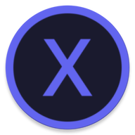
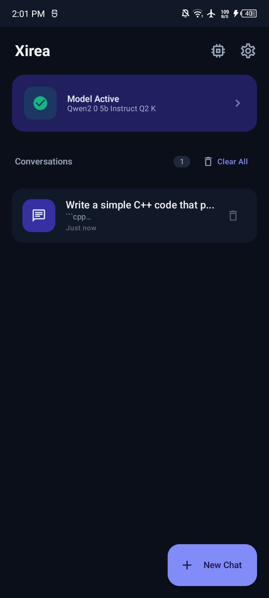
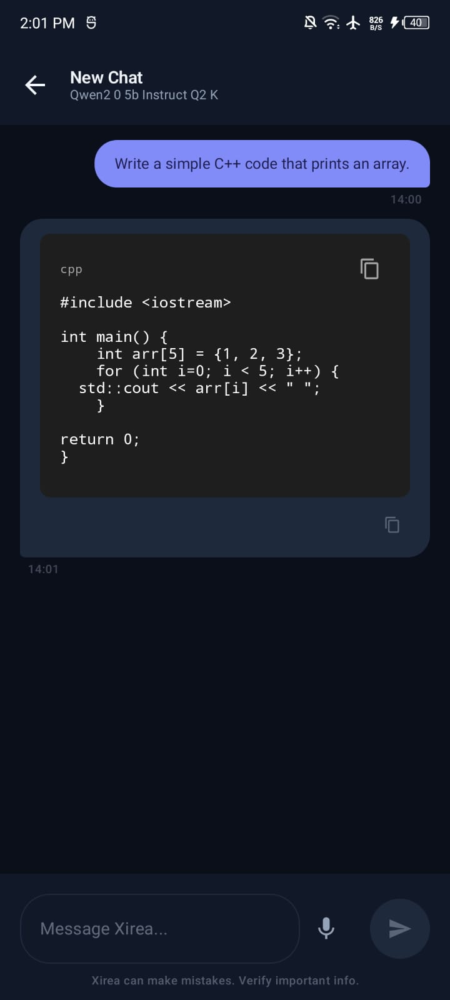
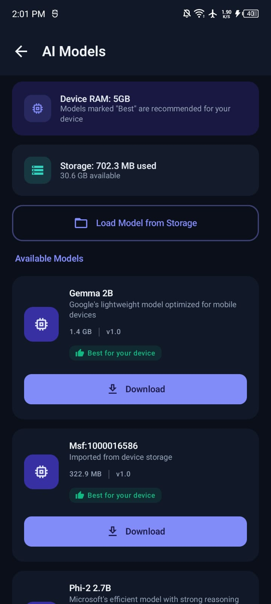
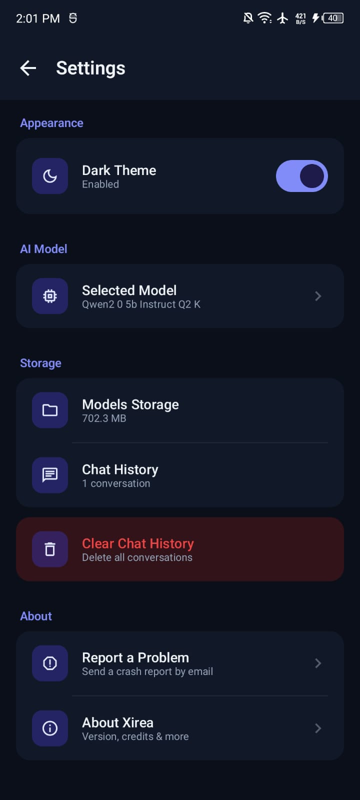

# Xirea

<p align="center">
  
</p>

<p align="center">
  <b>Offline AI Chat Assistant for Android</b>
</p>

<p align="center">
  <a href="https://github.com/Danyalkhattak/xirea/releases"></a>
  <a href="LICENSE"></a>
  <a href="#"></a>
  <a href="#"></a>
  <a href="#"></a>
  <a href="#"></a>
</p>

<p align="center">
  <a href="#overview">Overview</a> &bull;
  <a href="#whats-new-in-v2">What's New</a> &bull;
  <a href="#features">Features</a> &bull;
  <a href="#screenshots">Screenshots</a> &bull;
  <a href="#installation">Installation</a> &bull;
  <a href="#building">Building</a> &bull;
  <a href="#tech-stack">Tech Stack</a> &bull;
  <a href="#license">License</a>
</p>

---

## Overview

**Xirea** is a fully offline AI chat assistant that runs lightweight language models directly on your Android device. No internet required, no API keys, no data leaving your phone &mdash; your conversations stay completely private.

Powered by [llama.cpp](https://github.com/ggerganov/llama.cpp) for efficient on-device inference with GGUF models.

---

## What's New in v2.0.0

### Local Model Persistence with Loading Indicator

Models are now stored persistently on-device after the first download. Once loaded, they remain available for instant reuse without re-downloading. A real-time **notification progress indicator** shows the exact percentage of model loading completion so you always know the status.

### Redesigned Theme System

A completely refreshed color palette for both **light and dark themes**:

| Theme | Description |
|-------|-------------|
| **Light** | Rich Indigo primary (`#4F46E5`), Teal secondary (`#0D9488`), Fuchsia tertiary (`#D946EF`) on a clean off-white surface (`#F8FAFC`) |
| **Dark** | Soft Indigo primary (`#818CF8`), Bright Teal secondary (`#2DD4BF`), Bright Fuchsia tertiary (`#E879F9`) on a deep midnight background (`#0B0F1A`) |

The design also features improved spacing, refined typography using the full Material 3 type scale, and a polished visual identity across every screen.

### Voice Input

A built-in **voice input button** on the chat screen lets you dictate your prompt using Android's speech recognition. Your spoken words are automatically transcribed and inserted into the chat input field &mdash; no typing required.

### UI/UX Overhaul

- Redesigned navigation and screen transitions
- Improved chat bubble styling with clearer visual hierarchy
- Better model management interface with storage tracking
- Enhanced code block rendering with a copy button
- Markdown support with tables, task lists, and strikethrough
- Edge-to-edge immersive display
- Crash reporting system for stability

---

## Features

-  **100% Offline** &mdash; All AI processing happens on-device
-  **Fast Inference** &mdash; Optimized for mobile with dynamic RAM scaling
-  **Local Model Storage** &mdash; Download once, use forever; progress %age in notification
-  **Voice Input** &mdash; Dictate prompts directly into the chat
-  **Chat History** &mdash; Persistent local storage with Room database
-  **Model Management** &mdash; Download, import, switch, and delete AI models
-  **Refined Themes** &mdash; Beautiful indigo/teal/fuchsia palette for light and dark
-  **Markdown Rendering** &mdash; Tables, code blocks with copy, task lists, strikethrough
-  **Modern UI** &mdash; Built with Jetpack Compose & Material 3
-  **Privacy First** &mdash; No data collection, no servers, no tracking

---

## Screenshots

| Home | Chat | Models | Settings |
|------|------|--------|----------|
|  |  |  |  |

---

## Installation

### Requirements

- Android 8.0+ (API 26)
- ARM64 device (arm64-v8a)
- At least 4GB RAM recommended
- Storage space for AI models (500 MB &ndash; 4 GB per model)

### Download

<p align="center">
  <a href="https://github.com/Danyalkhattak/Xirea/releases/download/v2.0.0/Xirea-v2.0.0.apk">
    
  </a>
</p>

Or browse all versions on the [Releases](https://github.com/Danyalkhattak/xirea/releases) page.

---

## Building

### Prerequisites

- Android Studio Hedgehog or newer
- Android NDK 29.0.14206865
- CMake 3.22.1
- JDK 17

### Steps

1. **Clone the repository**
   ```bash
   git clone https://github.com/Danyalkhattak/Xirea.git
   cd Xirea
   ```

2. **Set up llama.cpp**
   ```bash
   git clone https://github.com/ggerganov/llama.cpp.git app/src/main/cpp/llama.cpp
   ```
   See [LLAMA_SETUP.md](LLAMA_SETUP.md) for detailed instructions and build options.

3. **Open in Android Studio**
   - Open the project folder in Android Studio
   - Wait for Gradle sync to complete

4. **Build Debug APK**
   ```bash
   ./gradlew assembleDebug
   ```

5. **Build Release APK** (requires signing keystore)
   ```bash
   ./gradlew assembleRelease
   ```

   Set signing properties in `local.properties`:
   ```
   RELEASE_STORE_FILE=path/to/keystore.jks
   RELEASE_STORE_PASSWORD=your_store_password
   RELEASE_KEY_ALIAS=your_key_alias
   RELEASE_KEY_PASSWORD=your_key_password
   ```

The APK will be generated at `app/build/outputs/apk/`

---

## Tech Stack

<p align="center">
  
  
  
  
  
  
  
  
</p>

---

## Supported Models

Xirea works with GGUF format models. Recommended models for mobile:

| Model | Size | RAM Required |
|-------|------|--------------|
| Qwen2 0.5B Q4 | ~400 MB | 4 GB |
| TinyLlama 1.1B Q4 | ~669 MB | 4 GB |
| Phi-2 2.7B Q4 | ~1.6 GB | 6 GB |
| Gemma 2B Q4 | ~1.5 GB | 6 GB |

You can also **import any local GGUF model** from your device storage via the model management screen.

---

## Performance Optimization

Xirea automatically adapts to your device hardware:

| Device RAM | Context Size | Batch Size | Threads |
|------------|--------------|------------|---------|
| 4 GB | 512 | 128 | 2 |
| 6 GB | 768 | 256 | 4 |
| 8 GB | 1024 | 256 | 6 |
| 12 GB+ | 2048 | 512 | 8 |

- **CPU-only inference** for maximum device compatibility
- **Memory-mapped model loading** for reduced RAM usage
- **Pre-allocated batch buffers** for zero-allocation generation loops
- **Near-greedy sampling** (top-k=20, top-p=0.85, temp=0.6) for focused, fast responses
- **Streaming token output** with ~33 ms throttle for smooth UI updates
- **Token guard buffer** to prevent partial stop-sequence artifacts

---

## Project Structure

```
Xirea/
├── app/src/main/
│   ├── java/com/dannyk/xirea/
│   │   ├── ai/                 # AI engine & llama.cpp JNI wrapper
│   │   │   ├── AIEngine.kt     # High-level generation with ChatML prompts
│   │   │   └── LlamaCpp.kt     # JNI bridge class
│   │   ├── data/
│   │   │   ├── dao/            # Room DAOs (Chat, Message, AIModel)
│   │   │   ├── database/       # XireaDatabase (Room, migration v2)
│   │   │   ├── download/       # ModelDownloader (Flow-based progress)
│   │   │   ├── model/          # Entity classes (Chat, Message, AIModel)
│   │   │   ├── preferences/    # UserPreferences (DataStore)
│   │   │   └── repository/     # ChatRepository, ModelRepository
│   │   ├── navigation/         # Screen routes & XireaNavGraph
│   │   ├── service/            # Foreground download service with notifications
│   │   ├── ui/
│   │   │   ├── about/          # About screen
│   │   │   ├── chat/           # Chat screen & ViewModel
│   │   │   ├── components/     # MarkdownText composable (Markwon)
│   │   │   ├── home/           # Home screen & ViewModel
│   │   │   ├── models/         # Model management screen
│   │   │   ├── report/         # Crash report screen
│   │   │   ├── settings/       # Settings screen
│   │   │   └── theme/          # Color palette, Theme, Typography
│   │   └── util/               # VoiceInputHelper, CrashReporter
│   ├── cpp/
│   │   ├── CMakeLists.txt      # Native build configuration
│   │   └── llama_jni.cpp       # C++ JNI bridge (~557 lines)
│   └── res/                    # Android resources
├── screenshots/                # App screenshots
├── LLAMA_SETUP.md              # llama.cpp build guide
├── gradle/libs.versions.toml   # Version catalog
└── build.gradle.kts
```

---

## Contributing

Contributions are welcome! Please feel free to submit a Pull Request.

1. Fork the repository
2. Create your feature branch (`git checkout -b feature/amazing-feature`)
3. Commit your changes (`git commit -m 'Add amazing feature'`)
4. Push to the branch (`git push origin feature/amazing-feature`)
5. Open a Pull Request

---

## License

This project is licensed under the MIT License &mdash; see the [LICENSE](LICENSE) file for details.

---

## Author

**Danyal Khattak**

<p>
  <a href="https://github.com/Danyalkhattak"></a>
  <a href="https://instagram.com/dannyk_739"></a>
</p>

---

## Acknowledgments

- [llama.cpp](https://github.com/ggerganov/llama.cpp) &mdash; High-performance C++ LLM inference engine
- [Jetpack Compose](https://developer.android.com/jetpack/compose) &mdash; Modern Android UI toolkit
- [Material 3](https://m3.material.io/) &mdash; Design system
- [Markwon](https://github.com/noties/Markwon) &mdash; Markdown rendering for Android

---

<p align="center">
  Made with  by <b>Danyal Khattak</b>
</p>